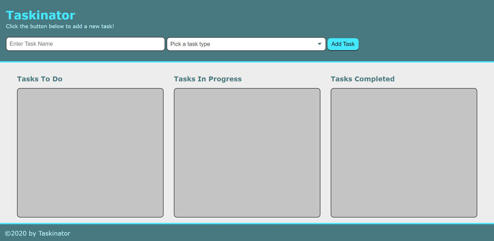
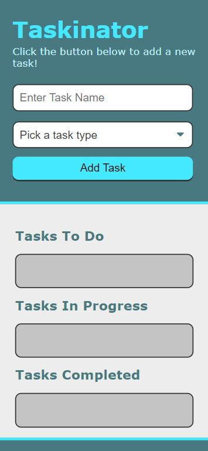
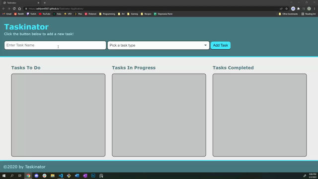
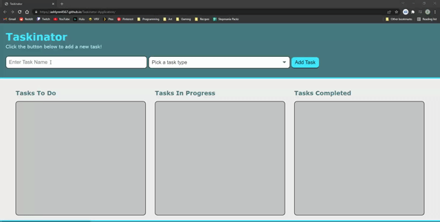

# Taskinator

## Welcome to Taskinator.

This project allowed me the experience of using Web API's (specifically DOM and localStorage) to add interactivity and dynamic behavior to a web application. This application is designed to allow a user to interactively update and track a to-do list of items within their browser. Tasks dynamically appear on the page as a user creates them. They remain persistent even after refreshing the page due to added localStorage capabilities.

[add challenges later]

## Usage and Features

This is how the main page appears to users. The page is responsive, adapting to multiple screen sizes.

The user can use this application to track their tasks. The user can use the input box at the top of the page to type a task name, select a task type, and save it to their dashboard. The saved task automatically goes into the "Tasks to Do" column. There are also interactive buttons that dynamically appear on the task itself. The user can use these buttons to edit/update their tasks, or delete them from view.

If the user wishes to change the status of their task, they can use the dropdown list interactively to move each task to whatever column they want.

The tasks each user creates is saved in their local storage. This way, even if the user refreshes the page or returns to it at a later date, their tasks are saved.

## Try it for yourself!

<a href="https://ashlynn4567.github.io/Taskinator-Application/">Click here to track your tasks!<a>

## Suggestion Box

In the future, I would like to add the following improvements:

- Task persistence should extend to which column the task is placed in upon refresh (currently if you refresh, all tasks move back to the "To Do" column).
- Adding the ability to further customize your task by color or other labels.
- Add ability to change the color theme of the page.
- Add ability to record dates or times to assign tasks to specific days. The user should only be able to see their tasks for the current day. The user should also have the ability to switch their view to a daily, weekly, or monthly task list. Tasks should only appear on their assigned time frame (i.e. April 14th task appears on april 14 in real time).

I'm a big believer in always refactoring code to improve it's functionality. If you would like to suggest your own improvements, you can reach me at the following links.

- <a href="https://github.com/ashlynn4567">GitHub<a>
- <a href="www.linkedin.com/in/Ashley-Lynn-Smith">LinkedIn<a>

## Credits

This project was built with the help of the University of Oregon's Coding Boot Camp.
